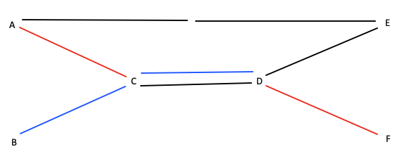
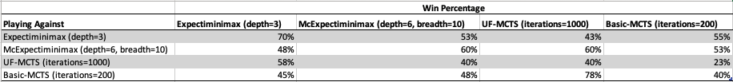
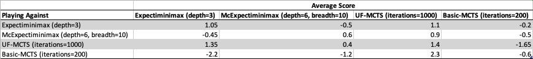
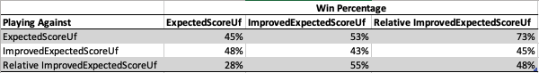
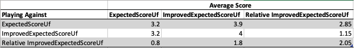

# Ticket to Ride AI  
  
Developed by William Stevenson as final project for CS 4100 (AI) at Northeastern University in Fall 2021.  
  
## Problem  
  
_Ticket to Ride_ is a board game that my family and I frequently play together. It is a 2-5 player game in which the players race to build rail networks across a map to score points. Rather than attempting to explain the rules in depth here,  [here is a link to the instructions](https://ncdn0.daysofwonder.com/tickettoride/en/img/tt_rules_2015_en.pdf). However, I will briefly go over the basics. The board is a map of the United States and Canada that shows selected cities and potential links between them. Each player has a set of “destination ticket” cards that have on them two cities and a point value; if the player connects the cities by building routes, they get the point value on the card. The players take turns, during which they can either draw “train car” cards or build routes using previously drawn “train car” cards. The game ends once one player builds a certain number of routes, and the player with the most points at that time is crowned winner. (There are also some additionally ways to score points or be penalized points.) An important note about the game is that it is non-deterministic. Drawing cards from decks is a core part of the game, which of course involved randomness. This practical tract project is to create an AI to play this game.  
  
## General Implementation Details  
  
### Game Logic  
  
The game logic is implemented in a very decentralized way to facilitate using tree search algorithms. The code is structured so that the game itself is treated similarly to a player in the game, in that a `TurnState` in the code can be either a player’s turn or the game’s turn, and a game turn represents the game about to deal cards. When it is the game’s turn, the game chooses an action, just like a player, where the action represents some random deal being performed.  
  
The entry point to playing a game is the `play_game` method, which contains little logic. Instead, the method is given a set of `Actor`s. There is one `GameActor`, and a `PlayerActor` for each player. The method asks the game actor whose turn it is, asks that actor for their move, and then tells each actor what the chosen move is.  
  
Each actor individually tracks the game state, which is necessary because they all have different views of the board. The game, unlike the players, knows what cards are coming up next in the decks. Also, the players each know their own hand but have limited knowledge of other players’ hands. Each `PlayerActor` holds a `State` object, which represents the current state of the game from their perspective.  
  
### Tracking State  
  
The `AbstractState` object is used to represent game states for the AI. For the most part, it simply holds game information. However, there are a few values that are tracked by the state because they would otherwise need to be frequently recalculated by the utility function. These values are:  
 - The destination cards completed so far  
 - The points each player has scored so far from building routes and completing destination cards.  
 - A `Clusters` object for each player, which tracks the routes built by them so far  
  
`Clusters` is a class that represents a rail network built by a player so far. It holds a list of clusters build by the player so far, where a cluster is a set of cities that have already been connected. Additionally, it holds precomputed values for the distance between any two cities using this rail network. (In this context, the distance is the number of trains needed to connect the two cities. Two already connected cities, which means they are in the same cluster, have distance 0.) Initially, these distances between cities are obtained using Floyd-Warshall. As routes are built, they are updated in `n²` time, where  `n` is the number of cities.  
  
Additionally, there are two different `AbstractState` implementations: `ObservedState` and `KnownState`. The difference between these relates to the fact that a player does not have full knowledge of other players' hands. `ObservedState` acknowledges this reality, and models the game in a way that reflects it. The state is from the perspective of a specific player, and other players' hands are not known. `KnownState`, on the other hand, ignores this and makes the hands of other players fully known. Although this is not reflective of the real game, it is interesting to see how the AI performs when using `ObservedState` versus `KnownState`.  
  
## Approaches (AI Algorithms Used)  
  
This project contains a number of different AI algorithms which were each independently used. This section describes what those algorithms are. See the [Results](##Results) section to see details about how each performs.  
  
### Expectiminimax  
  
[Expectiminimax](https://en.wikipedia.org/wiki/Expectiminimax) was the first algorithm I used for the AI. It is a common AI algorithm that we discussed extensively in class, so I will not go into detail about it. It is implemented by the `McExpectiminimaxActor` class, located in [mc_expectiminimax.py](trains/ai/mc_expectiminimax.py).  
  
#### Assuming States  
  
An added feature of `McExpectiminimaxActor` is a setting called `assume_states`, which is relavent when using `ObservedState`. Turning this on essentially adds another layer to the game tree when performing search. When the algorithm encounters a state where it is the turn of a player besides the AI, and the player has some cards that the AI doesn't know, it branches the state. Each branched state corresponds a different hand the player could have, and a probability is given to how likely the player is to have the hand. The algorithm then performs expectiminimax on each of those states, and gets the expected value based on the computed values and probabilities. This causes the utility function to be much more accurate since it will "know" what cards the player has when computing their expected score.  
  
### Monte-Carlo Expectiminimax (McExpectiminimax)  
  
McExpectiminimax is my name for my first, naive attempt at creating a monte carlo algorithm to improve the AI by reducing the branching factor. It works nearly the same as Expectiminimax (hence the name). In fact, Expectiminimax is simply a special case of it, and so they are implemented with the same class (`McExpectiminimaxActor`). Compared to Expectiminimax, McExpectiminimax has an additional parameter, which is a breadth function. Given a depth, the breadth function optionally returns a breadth. At each stage step in searching the game tree, the breadth function is queried by the algorithm. If it does not return a breadth, each branch is searched, just like in Expectiminimax. If it does return some breadth, then it randomly chooses that many branches to search. However, it only limits the breadth if it is not a state representing a player's turn in order to consider all possible player moves. If this were not done, an obviously good move could be never considered.  
  
McExpectiminimax also utilizes the `assume_states` feature.  
  
### Basic Monte Carlo Tree Search (Basic-MCTS)  
  
McExpectiminimax is not a good monte-carlo solution. Although it helps reduce the branching factor, it does so in a naive way by randomly chooses branches. Instead, it could be greatly improved by choosing the branches that are the most promising first and exploring those in greater depth.  
  
Standard [Monte-Carlo Tree Search](https://en.wikipedia.org/wiki/Monte_Carlo_tree_search) does exactly that, so it was the next algorithm I implemented in search of a better AI. Given a starting state, the algorithm randomly plays out a game to determine a winner. It then records that information and repeats this. In subsequent playouts, it prefers choosing actions that lead to wins more frequently, using [a formula](https://en.wikipedia.org/wiki/Monte_Carlo_tree_search#Exploration_and_exploitation) to balance exploration versus exploitation. After doing this some arbitrary number of times, it returns the most promising action.  
  
The reality is slightly more nuanced - the pseudocode is below:  
  
```python  
def mcts(state, n):  # n is the number of iterations to perform
	tree = Node(state)
	for _ in range(n):
		leaf = select_leaf(tree)
		leaf = expand(leaf)
		winner = randomly_playout_game_from_state(leaf.state)
		backup(leaf, winner)
		return tree.best_action()  

def select_leaf(node):
	if node.is_expanded:
		for child in current_node.children:
			# use UCT to balance exploration vs excitation
			# c is some constant, usually 2
			q = child.wins / child.visits
			u = c * sqrt(ln(current_node.visits) / child.visits)
			uct = q + u
			return select_leaf(child_with_max_uct)
	else:
		return node

def expand(leaf):
	action = leaf.random_action_not_yet_explored
	if action is None:
		leaf.explored = True
		return leaf.make_child(action)

def backup(leaf, winner):
	leaf.visits += 1
	if leaf.state.player_whose_turn_it_is == winner:
		leaf.wins += 1
	if leaf.parent is not None:
		backup(leaf.parent, winner)  
```  
  
An interesting this about this algorithm is that it requires no knowledge of the game - only the game logic needs to be implemented.  
  
### Monte Carlo Tree Search with Utility Function (UF-MCTS)  
  
A potential issue with Basic-MCTS is that it knows nothing about the game. Although scoring actions based on random playouts may work in some games, I have little faith in it for _Ticket to Ride_. The issue I foresee has to do with completing destination cards: a player does not get partial points for partially connecting cities. If two cities are not close together, it is extremely unlikely that the two cities will be connected due to random playout. As a result, the Basic-MCTS algorithm will never find nodes where destination cards are completed. As a result, it likely will not bother trying to connect cities and instead will simply build random routes to earn points.  
  
My solution to this was to use a utility function instead of random playout. UF-MCTS is nearly identical to Basic-MCTS. The line `winner = randomly_playout_game_from_state(leaf.state)` is replaced with `utility = utility_of_state(leaf.state)` (where `utility_of_state` gives a mapping of players to utility scores for the specific player). Additionally, `backup` is modified:  
  
```python
def backup(leaf, utility):
	leaf.visits += 1
	leaf.utility += utility[leaf.state.player_whose_turn_it_is]
	if leaf.parent is not None:
		backup(leaf.parent, winner)
 ```  
  
## Miscellaneous Algorithms  
  
### Train Card Probability  
  
A problem that appears in multiple places in the code is the following:  
Given a deck of colored cards and some set of colored cards, calculate the probability of drawing the set of cards in `n` draws. For example, if you know the deck has 2 blue, a green, and 3 reds, calculate the probability of drawing (at least) 2 reds and a blue in 4 draws.  
  
This is a calculation that ended up being non-trivial to solve. Many ideas that seemed good turned out to be incorrect due to a false assumption of independence or disjointness. After a lot of head scrathing and not being able to find anything on Google, I resigned to brute forcing the solution.  
  
This is implemented by the function `probability_of_having_cards` in `trains/util.py`.  
  
### Shortest Path to Complete Destination Card  
  
An important calculation for the utility function is finding the shortest path to complete a destination card. (Note: This cannot be pre-calculated and reused. It changes throughout the game as routes are built by different players.) A* is used as a solution to this problem. For the heuristic, the distance between the two cities ignoring routes built by other players is used. This is an admissible heuristic since it loosens the restrictions, and it is readily available, since a `Clusters` object stored in the state tracks it (as discussed in [Tracking State](#tracking-state)).  
  
This is implemented by the function `best_routes_between_cities` in `trains/util.py`.  
  
### Shortest Path to Complete Multiple Destination Cards  
  
This is the same problem as the one before, except it is the shortest path to complete multiple destination cards. Unfortunately, this is an NP-complete problem - the traveling salesman problem can be reduced to it in polynomial time. This is done by creating a destination card for each pair of cities (there are `n²` pairs of cities) and running the problem with those destination cards and no routes built so far.  
  
As a result, a heuristic is instead used to compute a good-enough solution. To do so, it begins with the `Clusters` object representing routes built by the player so far. Then, it takes the destination card whose cities are farthest apart according to the clusters and finds the best route for it. These routes are added to the clusters, and the process is repeated until there are no destination cards left.  
  
This is implemented by the function `best_routes_between_many_cities` in `trains/util.py`.  
  
## Utility Function  
  
All utility functions implement the abstract class `UtilityFunction` and are located in the file `trains/ai/utility_function.py`.  
  
### ExpectedScoreUf  
  
`ExpectedScoreUf` calculates an expected score for each player. It works by first retrieving how many points a player has earned so far by completing destination cards and building routes. Then, it computes the expected number of turns left in the game. Based on this, it computes an expected number of points for a player to earn from building routes. Additionally, it calculates the probability of completing all destination cards to get an expected value of points earned from destination cards not yet complete. (Note that this is treated as a binary thing, where either all or none of the destination cards are completed.) These numbers are all added together to obtain a total expected value of points.  
  
The calculation of the probability of completing destination cards is nuanced and worth exploring. My solution is to compute the shortest path to complete each destination card using [the above mentioned algorithm](###shortest-path-to-complete-destination-card) and then compute the number of additional train cards needed to build the path is calculated. These numbers for each card are then summed together. The sum is then used to estimate the number of train cards actually needed, based on the idea that there is a larger overlap between paths when the sum is larger. This number of needed train cards, together with the expected number of remaining turns, is used to estimate the probability of completing the destination cards.  
  
### ImprovedExpectedScoreUf  
  
`ImprovedExpectedScoreUf` is similar to `ExpectedScoreUf`. The only difference is in how the probability of completing destination cards in calculated. Unlike `ExpectedScoreUf`, it calculates the shortest path to complete _all_ destination cards instead of one at a time. Additionally, it resolves a bug that appeared in `ExpectedScoreUf`.  
  
### RelativeUf  
  
`RelativeUf` is a wrapper for other utility functions. It is given a utility function and calculates the utility using it. However, for each player, it return the players utility minus the highest utility out of the opposing players. This way, it gives the utility relative to other players. This helps make utility functions that give a relative score correspond more to a probability of winning since a higher score doesn't mean a higher chance of winning.  
  
## Results  
  
The AI is too slow to work on a full board. As a result, the tests I have conducted have been on a smaller board that I made up, which is show below:  
  
The full rules for this smaller game are defined by `Box.small` in [box.py](trains/game/box.py).  
  
However, after much playing of the game, I believe that the first player almost always has a winning strategy. The game is so short that having that extra move makes a big difference.  
  
### AI Evaluation / Comparison  
  
The AI that performs the best against me is the UF-MCTS AI using `RelativeUf` wrapped around `ImprovedExpectedScoreUf`. With high iteration counts, it seems to always beat me when it goes first, and I usually beat it when I go first.  
  
Below are tables comparing how the different AI algorithms perform against each other. The first shows each AI's win percentage against each AI, and the second show's their average score. These are calculated over 20 games, with AIs splitting going first. The parameters for each AI algorithm were chosen so that they use roughly the same compute time. Each AI uses `RelativeUf` wrapped around `ImprovedExpectedScoreUf` as its utility function:  
  
  
  
  
### Utility Function Comparison  
  
Below are tables comparing how the different utility functions perform against each other. The first shows the win percentage using each utility function against each utility function, and the second show's their average score. These are calculated over 20 games, with AIs splitting going first. Each utility function is used by UF-MCTS with 1000 iterations:  
  
  
  
  
## Discussion

Unfortunately, I don't believe that the results mean a whole lot. I am not a board game designer, and that is for good reason. The small version of the game that I came up with is not a very skill based game. Rather, going first is a large advantage. Further, there is a large amount of luck involved, as the initial deal is very important. As a result, the games have a lot of noise in them. This is evidenced by the inconsistencies in win percentages between algorithms. For example, UF-MCTS beat Basic-MCTS 78% of the time, which beat Expectiminimax 55% of the time, which beat UF-MCTS 58% of the time. This shows that an algorithm having a high win percentage against another doesn't necessarily mean it is better.

The results shown above, which are from a simulation of only 20 games, took about half an hour to run. Bumping the number of simulations up to a number where they become statistically significant would number be practical considering the computing power available to me and the time restrictions of this project.

Although I enjoyed working on this project a lot, I think I bit off more than I can chew. As much as I would like to make a functional _Ticket to Ride_ AI, I would need to sink a large amount of additional time into developing it. I have put a lot of hours into this project (more than I think was intended) and would need to put a lot more in to create something that I am truly happy with, so I need to cut off my work at some point. That being said, my primary goal of this project was to explore Monte-Carlo Tree Search, and I believe I have achieved that goal. Exploring different approaches to tree search algorithms was an imformative process.

Further, I believe that writing a utility function for a non-straighforward game was a fun problem to tackle. Coming up with an algorithm to estimate how many points a player will score is a complex problem without a straightforward solution, so solving it was very different from problems that we did in class. It forced me to internalize the fact that in AI, sometimes a rough, imprecise solution is the best we can do.

Fortunately, I consider the goals that I set in my milestone report to have been met. They were:

 1. Create a better MCTS algorithm that is smarter about which branches to expand and chooses to search deeper on more interesting branches.
 2. Improve the utility function to make logical moves. Although I don’t expect the AI to do well, I want it to play in a way (on the small board at least) that is reasonable.
 
The first was written when McExpectiminimax was the monte-carlo algorithm that I was using. Since then, I have gained a much better understanding of MCTS, and I was able to implement a solution that I consider to be much better than the initial. As a result, I consider the first goal to be met. The second, too, I consider to be met. Although the AI does not work well on a full sized board, it performs well on the small one. The moves that it performs are usually similar to or the same as the move I would make, and it is at about the same skill level as me.

## Next Steps

The most immediate next step I would make with this project is to create a better small version of the game to use for analysis. It is unsatisfying to not have a good measurement of the skill of the various AIs, but due to practical considerations, it is not feasible for me to do so at this time.

Next, I would attempt to speed up the code in order to allow the AI to explore the game tree more. So far, I have profiled the code and done some marginal speedups. However, there are still a few functions that are quite slow (mainly `probability_of_having_cards`) that I would like to optimize.

After that, I believe there is a lot of room for improvement in the utility function. The current utility functions work good enough on a small board, but when the game becomes more complex on a larger board, this is not so true. Fixing this would likely be a lot of work as it would require a lot of trial and error. A way that would be especially interesting to do this would be to create a neural network for this problem. In my research of MCTS, I ran into a few articles that discussed AlphaGo Zero, a DeepMind project that was the successor of AlphaGo. AlphaGo Zero (based on my limited research) uses MCTS as its primary architectue. However, its utility function is a ML model that trained by playing itself many times. Of course, this would be a difficult problem and require a lot of computing power. However, it could be interesting to explore and may produce useful results.
